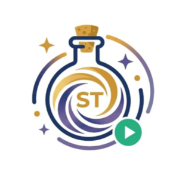

<div align="center">
  

# Astra UI

面向 [iced](https://iced.rs/) 的 Rust 桌面 UI 组件库与设计系统。

[](https://www.rust-lang.org/)
[](https://crates.io/crates/iced-astraui)
[](https://docs.rs/iced-astraui)
[](https://iced.rs/)
[](LICENSE)
[](#项目状态)

</div>

Astra UI 使用 Rust 原生实现，不依赖 WebView。它借鉴 HeroUI v3 清晰、克制的视觉语言，并针对 iced 的消息驱动模型和桌面交互方式重新设计组件 API。项目集中提供颜色、排版、间距、圆角和动效规范，减少应用中重复的样式代码。

> Astra UI 是独立项目，与 HeroUI 官方没有隶属或合作关系。

## 能力概览

- 原生 iced 组件，可与 `iced::widget` 直接组合。
- 统一的语义色、尺寸、圆角、排版和交互状态。
- `Primary`、`Secondary`、`Ghost`、`Destructive` 等语义化变体。
- 按钮、开关、复选框、导航和进度控件的轻量动效支持。
- 内置 HarmonyOS Sans 六种字重与 Lucide 图标适配。
- 可运行的 Showcase，覆盖组件、设计令牌和常见组合模式。

## 组件

| 分类 | API |
| --- | --- |
| 内容与容器 | `Avatar`、`badge`、`Card`、`Surface`、`chip`、`Kbd`、`Separator`、`Typography` |
| 输入与操作 | `Label`、`TextArea`、`InputOTP`、Button styles、Checkbox styles、`radio`、`slider`、`switch`、Toggle Button、Tag Group |
| 导航 | `Accordion`、`disclosure`、`pagination`、`Tabs`、`ListBox`、`toolbar` |
| 反馈 | `Alert`、Global Message、Progress Bar、Progress Circle、Toast |
| 浮层 | Context Menu、Dropdown、`AlertDialog`、`Drawer`、Global Modal、Tooltip |
| 布局基础 | `GlobalLayer`、`ScrollShadow` |

此外，Astra UI 为 iced 原生 `text_input`、`pick_list`、`button`、`checkbox` 等控件提供配套样式函数。

## 快速开始

### 环境要求

- Rust 1.85 或更高版本
- Cargo
- iced 支持的桌面平台；当前主要在 macOS 上开发和验证

### 运行 Showcase

```bash
git clone https://github.com/AstraBrew-Labs/iced-astraui.git
cd iced-astraui
cargo run --release --example showcase
```

Showcase 包含三个页面：`Components` 展示交互组件，`Tokens` 展示颜色与排版令牌，`Patterns` 展示组合模式。

### 添加依赖

Cargo 包名是 `iced-astraui`，Rust 代码中的 crate 名是 `astra_ui`。已发布到 [crates.io](https://crates.io/crates/iced-astraui)，直接按版本添加依赖：

```toml
[dependencies]
iced = "0.14"
iced-astraui = "0.0.1"
lucide-icons = { version = "1.31", features = ["iced"] }
```

如需使用尚未发布的最新提交，可引用 Git 仓库：

```toml
[dependencies]
iced = "0.14"
iced-astraui = { git = "https://github.com/AstraBrew-Labs/iced-astraui" }
lucide-icons = { version = "1.31", features = ["iced"] }
```

在本地同时开发应用和组件库时，可以使用路径依赖：

```toml
[dependencies]
iced = "0.14"
iced-astraui = { path = "../iced-astraui" }
lucide-icons = { version = "1.31", features = ["iced"] }
```

### 最小示例

```rust
use astra_ui::{fonts, ui, Alert, AlertKind, ButtonVariant, Card};
use iced::widget::{button, column, text};
use iced::{Element, Fill, Task, Theme};
use lucide_icons::LUCIDE_FONT_BYTES;

#[derive(Default)]
struct App;

#[derive(Debug, Clone)]
enum Message {
    Save,
    Dismiss,
}

impl App {
    fn update(&mut self, _message: Message) -> Task<Message> {
        Task::none()
    }

    fn view(&self) -> Element<'_, Message> {
        Card::new(
            column![
                text("Workspace settings"),
                Alert::new("Configuration synced")
                    .description("All changes are stored locally.")
                    .kind(AlertKind::Success)
                    .on_close(Message::Dismiss),
                button("Save")
                    .on_press(Message::Save)
                    .style(ui::button_style(ButtonVariant::Primary)),
            ]
            .spacing(16)
            .width(Fill),
        )
        .width(Fill)
        .into()
    }

    fn theme(&self) -> Theme {
        ui::app_theme()
    }
}

fn main() -> iced::Result {
    let mut application = iced::application(App::default, App::update, App::view)
        .theme(App::theme)
        .font(LUCIDE_FONT_BYTES);

    for (_, bytes) in fonts::FONT_MAPPINGS {
        application = application.font(bytes);
    }

    application.default_font(fonts::REGULAR).run()
}
```

组件可从 crate 根路径导入，也可以使用 `astra_ui::ui::*` 兼容路径或 `astra_ui::prelude::*`。部分组件内部也会使用 Lucide 图标，因此应用需要注册 `lucide_icons::LUCIDE_FONT_BYTES`；完整方式可参考 [`examples/showcase.rs`](examples/showcase.rs)。

## 设计与状态

应用主题通过 `ui::app_theme()` 获取。颜色和尺寸令牌由 crate 根路径与 `ui` 模块共同导出，例如 `BLUE_600`、`INK_MUTED`、`RADIUS_FIELD` 和 `CONTROL_HEIGHT_MD`。

Astra UI 遵循 iced 的状态所有权：业务状态与 `Message` 保留在应用中，组件接收当前值和消息。需要动画时，由应用持有 `MotionState`，通过订阅产生 tick，再将动画进度传给对应的 animated style。`Tabs` 通过 `TabItem` 组合标签与面板，使用 `.selected(...)` 和 `.on_selection_change(...)` 管理受控选中状态，支持 `TabsVariant::Primary/Secondary` 及水平、垂直布局。`TextArea` 使用 `text_editor::Content`，`ListBox` 通过回调将选择事件交还给应用。`InputOTP::new` 的回调接收 `InputOtpChange`，其中包含最新 `value`、编辑槽位、`Input`/`Backspace` 动作以及下一焦点槽位的 `focus_id`；应用更新值后可返回 `iced::widget::operation::focus(change.focus_id)`，实现连续输入和反向删除。`Drawer` 同样由应用控制是否渲染，支持四边停靠、遮罩变体、可滚动正文、Footer、关闭按钮、不可关闭遮罩和 `animation_progress` 过渡进度；`AlertDialog` 与 `global_modal_with_options_animated` 也支持同样的进度驱动过渡，`on_interact` 消息用于消费抽屉或弹窗内部空白区域的点击。

浮层组件不会自行管理应用状态。Modal、Drawer、Toast、Dropdown 和 Context Menu 的可见性、内容及关闭事件均由调用方控制；`global_message_animated_with_placement` 和 `toast_animated_with_placement` 接收调用方维护的过渡进度、进入/退出阶段与 `ToastPlacement`。全局消息和 Toast 会使用同一套位置方向映射，自动选择水平或垂直滑动方向，并沿进入路径返回。多个浮层可通过 `GlobalLayer` 统一确定层级。

## 项目结构

```text
iced-astraui/
├── assets/
│   ├── fonts/              # HarmonyOS Sans 字体
│   └── icon/               # 项目与 Showcase 图标
├── examples/
│   ├── showcase.rs         # Showcase 入口
│   └── showcase/app.rs     # 示例状态、消息与页面
├── src/
│   ├── components/         # 组件、样式和设计令牌
│   ├── fonts.rs            # 字体常量与内嵌字体映射
│   ├── icons.rs            # Lucide 图标辅助函数
│   ├── lib.rs              # crate 根模块与公共导出
│   └── ui.rs               # 兼容性公共导出层
├── llms.md                 # 面向 AI 工具的完整项目上下文
├── llms.txt                # 精简的 llms.txt 项目索引
└── Cargo.toml
```

## 开发与验证

```bash
cargo fmt --check
cargo check --all-targets
cargo test --all-targets
cargo doc --no-deps
cargo package
```

新增或修改组件时应复用现有令牌，覆盖默认、悬停、按下、聚焦、选中和禁用状态，并在 Showcase 中加入可交互示例。公共 API 变化还应同步更新 README、`llms.md`、`llms.txt` 与 `CHANGELOG.md`。

## 项目状态

Astra UI 当前处于早期开发阶段。`0.x` 期间公共 API 仍可能调整，请在升级时查阅 [`CHANGELOG.md`](CHANGELOG.md)。

## 许可证

项目基于 [MIT License](LICENSE) 开源。第三方字体和图标资源遵循各自许可证。
